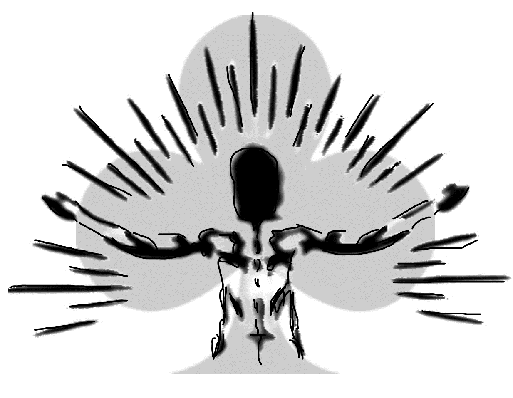

# Osmose 

Dans le cadre de l’UE Unity exercée pendant la dernière année de Master Informatique, nous avons
réalisé un jeu entièrement créé à partir de la plateforme de moteur de jeu Unity 3D.
Ce jeu a été inspiré par la série Alice in Borderland.

### Équipe
Ce projet a été réalisé par tous les membres de la formation soit par 13 personnes au total, ce qui
a eu pour conséquences d’avoir une bonne coopération entre membres, et une bonne organisation
entre les différentes parties à réaliser.
Nous nous sommes répartis en 5 sous-équipes : 
 - l'équipe UI qui gère l’interface utilisateur du jeu, constituée d’un seul membre,
 - l'équipe Map ui gère toute la modélisation de la map ainsi que ses matériaux et ses effets spéciaux, constituée de trois membres,
 - l'équipe Gameplay qui gère toutes les fonctionnalités du joueur dont le score et le son du jeu, constituée de cinq membres,
 - l'équipe Animation qui gère toutes les animations du joueur, ainsi que la création de la cinématique demandée, constituée d’un seul membre,
 - l'équipe Network qui gère le serveur du jeu pour un mode multijoueur fonctionnel, constituée de trois membres.

### Crédits
**ALBOUY Florent** (Animation) |
**BOUHEDJA Abdelmalek** (Gameplay) |
**CHARPY Raphael** (Gameplay) |
**CLERAND Lucie** (UI) |
**DAVID-BROGLIO Tom** (Network) |
**EL MOSSAOUI Ilyas** (Network) |
**JAMLI Fatma** (Map) |
**LAPORTE Loic** (Map) |
**POLO Charlene** (Gameplay) |
**REGA Eve** (Gameplay) |
**ROCHETTE-BERLON Etienne** (Gameplay) |
**SAINT-SORNY Alban** (Network) |
**TAGUET Benjamin** (Map)

### Règles du jeu et détails
Le but de ce jeu est simple : une partie dure 2h et l’équipe qui a le plus de points à la fin de ce temps a gagné. 
Les deux équipes commencent avec 10 000 points chacune que les joueurs se répartiront en début de partie. Vous pourrez les répartir comme vous voulez, mais vous ne
pouvez pas attribuer moins de 100 points à une personne. Attention, la répartition est comme qui dirait la clé de ce jeu.  
Chaque équipe a une base (opposée l’une à l’autre). Les façons de gagner des points sont limitées,
il existe seulement trois moyens : les combats, les coffres et la base. 
- les combats : Le résultat d’un combat dépend uniquement des points qu’il vous reste. Pour
affronter quelqu’un, il suffit de le toucher. Celui qui a le plus de points gagne. Le perdant
transfère 500 points au gagnant. Nous ne connaissons pas les points de son adversaire avant de
l’avoir combattu. S’associer : Ce jeu permet également d’initier un combat avec un partenaire.
Quand deux coéquipiers s’associent, ils combinent leur points. Cela leur permet de vaincre un
adversaire qu’ils ne pourraient pas vaincre individuellement. Si vous gagnez en étant associé,
vous vous partagez les 500 points.
- les coffres : ce sont des bonus cachés dans le terrain (6 initialement), ils peuvent rapporter entre 500 et 3000 points
- la base : elle donne une chance de renverser le jeu. Si vous touchez la base de l’équipe adverse
vous gagnez 10 000 points en une fois. C’est pour cette raison qu’une personne de chaque
équipe doit garder la base car tant qu’un joueur touche sa propre base, il a un nombre de
points infini. En cas d’un combat contre une personne ayant un nombre de points infinis,
nous perdons 10 000 points, le gagnant en récupère 10 000.

Si une personne a un score en dessous de 0 point, il est tué définitivement.
Les joueurs ayant eu une intéraction de combat ou avec la base ennemie deviennent inactifs et
ne peuvent plus gagner ou perdre de points. Il faut revenir à la base pour être actif de nouveau. Les joueurs inactifs peuvent cependant immobiliser un certain temps les joueurs ennemies en les touchant.

Nous avons modifié quelques éléments des règles du jeu initial. Le délai et les points initiaux sont
gérés manuellement, c’est à dire qu’une personne créant une partie décide du temps de jeu et du
nombre de points attribués par équipe. Dans la map se cache six coffres, cependant, ils rapportent
aléatoirement entre 500 et 3000 points selon leur emplacement.

## Cinématique ([lien vers le fichier](Assets/Animation/Cinematic.compressed.mp4))
